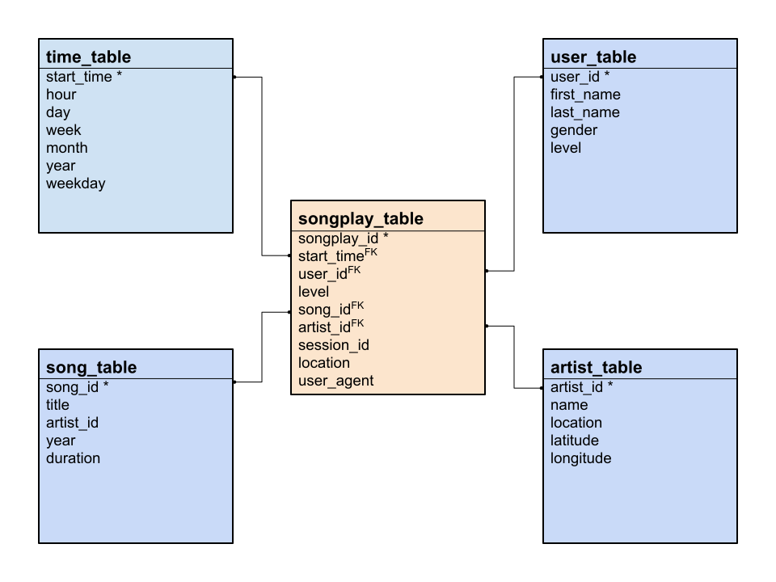

# Sparkify Data Warehouse


## Data Warehouse Purpose

Sparkify has a growing user base, and therefore it's data is growing. It wants to move its data and ETL processes entirely to the cloud.

Sparkify will store its raw data about (1) users' interaction with their music streaming app, and (2) the songs users play in AWS S3 buckets. Currently, all the data for users' app interacationi exists as JSON log files, and the song data exists as JSON metadata. This project stages the raw data from S3 buckets in an Amazon Redshift cluster. Within the same cluster the staged data is ETLed into a data warehouse with a star schema design.

The purpose of this data warehouse is to hold all the relevant data in one place, organized in a fact-and-dimension star schema, so that analysts and business intelligence users can easily query the data in order to learn about what songs users are listening to.


## Data Warehouse Design

### Schema

The data warehouse data is organized into a fact-and-dimension star schema. The fact table of this scheme is `songplay_table` (the target user activity) and the dimension tables are `time_table` (songplay start time data), `user_table` (user data), `song_table` (song data), and `artist_table` (artist data).



### ETL Pipeline

#### Create tables

The `create_tables.py` script uses SQL queries defined in `sql_queries.py` to drop any tables that might already exist, and then creates all the necessary tables for the data warehouse. 

#### Load tables

##### Star Schema

The `etl.py` script also uses SQL queries defined in `sql_queries.py` to (1) load the raw JSON data into the staging tables (`staging_events_table`, `staging_songs_table`), and (2) insert data into the fact and dimension tables of the star schema (`songplay_table`, `time_table`, `user_table`, `song_table`, `artist_table`).

Data for this star schema is sourced from raw JSON files in an S3 bucket. Data for the `user_table` is parsed from the JSON log files. Data for the `song_table` and `artists_table` tables is parsed from the JSON song metadata files. Data for the `songplay_table` is parsed from the raw JSON log data and JSON song data. Data for the `time_table` is parsed from the `songplay_table`.

##### Selected Fields

The `user_table` insert query selects the `userid`, `firstname`,  `lastname`, `gender`, and `level`.

Because the source of the `song_table` and `artist_table` is the song metadata files, they are processed similarly from the `staging_songs_table`. The only difference between the two is which fields are selected. The `song_table` insert query selects `song_id`, `title`, `artist_id`, `year`, and `duration`. The `artist_table` insert query selects `artist_id`, `artist_name`, `artist_location`, `artist_latitude`, and `artist_longitude`.

Loading data into the `songplay_table` relies on a join between the to staging datasets, `staging_events_table` and `staging_songs_table`. The two staging tables have three fields in common, song title, song length (in seconds), and artist name.

The `time_table` insert query select the `start_time` from the `songplay_table` and then derives the remaining fields, `hour`, `day`, `week`, `month`, `year`, and `weekday`.

##### Node Distribution Strategies

The `time_table`, `user_table`, and `artist_table` dimension tables will most often be joined on their primary keys, so the tables are sorted by the primary keys (`start_time`, `user_id`, and `artist_id`, respectively). Also, since these tables will likely be fairly small, they can be copied in full to each node slice. Therefore, the node slice distribution strategy is set to all (i.e., `DISTSTYLE ALL`)

Similar to the other dimension tables, the `song_table` will likely be joined on its primary key from the fact table, so it will be sorted by its primary key, `song_id`. However, unlike the other dimension tables, the `song_table` is expected to be quite large, so there is a different distrubtion strategy. Here, the table is distributed across the node slices by the primary key field, `song_id`, using `DISTKEY`.


## Example Queries

### Example 1

Here's a query that confirms our data were joined on matching values in the artist name, song title, and song length fields.

```
SELECT 
  ev.artist, 
  ev.song, 
  ev.length,
  so.artist_name,
  so.title,
  so.duration
FROM 
  staging_events_table AS ev, 
  staging_songs_table  AS so
WHERE
  ev.artist = so.artist_name AND
  ev.song   = so.title       AND
  ev.length = so.duration
LIMIT 10;
```

artist|song|length|artist_name|title|duration
---|---|---|---|---|---
Huey Lewis & The News|I Want A New Drug|286|Huey Lewis & The News|I Want A New Drug|286
The Smiths|The Boy With The Thorn In His Side|196|The Smiths|The Boy With The Thorn In His Side|196
Pearl Jam|Not For You|352|Pearl Jam|Not For You|352
The Smiths|The Boy With The Thorn In His Side|196|The Smiths|The Boy With The Thorn In His Side|196
Black Eyed Peas|Let's Get It Started|229|Black Eyed Peas|Let's Get It Started|229
Placebo|English Summer Rain|241|Placebo|English Summer Rain|241
The Verve|Bitter Sweet Symphony|360|The Verve|Bitter Sweet Symphony|360
Van Halen|Panama (Remastered Album Version)|209|Van Halen|Panama (Remastered Album Version)|209
Black Eyed Peas|Let's Get It Started|229|Black Eyed Peas|Let's Get It Started|229
De-Phazz|Astrud Astronette|205|De-Phazz|Astrud Astronette|205

### Example 2

This query does a simple join between the star schema fact table (`songplay_table`) and two dimension tables (`song_table`, `artist_table`).

```
SELECT
  sp.songplay_id,
  sp.song_id,
  so.title,
  ar.artist_id,
  ar.name
FROM
  songplay_table AS sp,
  song_table     AS so,
  artist_table   AS ar
WHERE
  sp.song_id   = so.song_id AND
  sp.artist_id = ar.artist_id
LIMIT 10;
```

songplay_id | song_id | title | artist_id | name
---|---|---|---|---
10|SODOLVO12B0B80B2F4|Hell|AR6XPWV1187B9ADAEB|Foo Fighters
16|SODWXQV12A6310F10D|English Summer Rain|AR6892W1187B9AC71B|Placebo
40|SOXQYSC12A6310E908|Bitter Sweet Symphony|AR0L04E1187B9AE90C|The Verve
24|SOXQYSC12A6310E908|Bitter Sweet Symphony|AR0L04E1187B9AE90C|The Verve
11|SOLRYQR12A670215BF|Panama (Remastered Album Version)|ARNLO5S1187B9B80CC|Van Halen
0|SOHDWWH12A6D4F7F6A|I Want A New Drug|ARC0IOF1187FB3F6E6|Huey Lewis & The News
1|SOZCTXZ12AB0182364|Setanta matins|AR5KOSW1187FB35FF4|Elena
8|SOAOJYY12A58A7B2F9|Not For You|ARFVYJI1187B9B8E13|Pearl Jam
2|SOFVOQL12A6D4F7456|The Boy With The Thorn In His Side|ARPN0Y61187B9ABAA0|The Smiths
3|SOFVOQL12A6D4F7456|The Boy With The Thorn In His Side|ARPN0Y61187B9ABAA0|The Smiths
