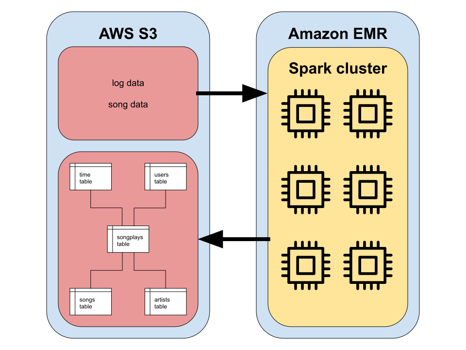

# Sparkify Data Lake


## Data Lake Purpose

Sparkify has a growing user base, and therefore it's data is growing. It wants to move its data and ETL processes entirely to the cloud.

Sparkify will store its raw data about (1) users' interaction with their music streaming app, and (2) the songs users play in AWS S3 buckets. Currently, all the data for users' app interactions exists as JSON log files, and the song data exists as JSON metadata. This project loads the raw data from S3 buckets into an Amazon EMR cluster wherein Spark ETLs the data using a star schema design into another S3 bucket.

The purpose of this data lake is to hold all the relevant data in one place, organized in a fact-and-dimension star schema, so that analysts and business intelligence users can easily query the data in order to learn about what songs users are listening to.


## Data Lake Design

### Schema

The data warehouse data is organized into a fact-and-dimension star schema. The fact table of this scheme is `songplays_table` (the target user activity), and the dimension tables are `songs_table` (song data), `artists_table` (artist data), `users_table` (user data), and `time_table` (songplay start time data).


### ETL Pipeline

The `etl.py` script run on an Amazon EMR Spark cluster does all the heavy lifting. Raw JSON data is loaded from a source S3 bucket. The raw data is transformed into tables that conform to a star schema data model. Finally, those star-schema tables are loaded to a destination S3 bucket data lake for use by data consumers.



#### Star Schema

The `etl.py` script user PySpark to (1) load the raw JSON data into the staging dataframes `song_df` and `log_df`, and (2) insert data into the fact table (`songplays_table`) and dimension tables of the star schema (`songs_table`, `artists_table`, `users_table`, `time_table`).

Data for this star schema is sourced from raw JSON files in an S3 bucket. Data for the `songs_table` and `artists_table` is parsed from the JSON song metadata files. Data for the `users_table` and `time_table` is parsed from the JSON log files. Data for the `songplays_table` is parsed from the raw JSON log data and the `songs_table`.

#### Selected Fields

Because the source of the `song_table` and `artist_table` is the song metadata files, they are processed similarly from the `song_df`. The only difference between the two is which fields are selected. The `songs_table` is comprised of `song_id`, `title`, `artist_id`, `artist_name`, `year`, and `duration`. The `artists_table` is comprised of `artist_id`, `artist_name`, `artist_location`, `artist_latitude`, and `artist_longitude`.

The source of the `users_table` is the `log_df`. The `users_table` is comprised of `user_id`, `first_name`, `last_name`, `gender`, and `level`. 

The source of the `time_table` is also the `log_df`, but it needs more work. The `log_df` contains a `ts` Unix epoch timestamp column (of type Long). This has to be transformed to a column with a data type of Timestamp before it can be loaded into the `time_table`. Once `ts` (Long) is transformed to `start_time` (Timestamp), the `start_time` column can be selected into the `time_table`. Then the `start_time` column can be used to derive additional columns in `time_table`: `hour`, `day`, `week`, `month`, `year`, and `weekday`.

Loading data into the `songplays_table` relies on a join between the `log_df` stating dataframe and `artists_table` on the columns `title`/`song`, `artist_name`/`artist`, and `duration`/`length`.

## Example Queries

The best way to run queries against this data lake is to do so on the EMR Spark cluster. An easy way to run queries is to create a Jupyter notebook with a (Py)Spark kernel through the Amazon EMR console. Another slightly more involved way to run queries is to create a Python script (e.g., `query.py` in this repo), upload it to the EMR cluster master, and submit it as a Spark application using `spark-submit query.py --master yarn`.

### Jupyter Notebook on EMR Cluster

This method simplifies setup and makes running queries against the data very simple.

#### Example Query 1

```$xslt
data_lake_bucket = "s3://aws-logs-164557480116-us-west-2/elasticmapreduce/data_lake/"

df_songplays = spark.read.parquet(data_lake_bucket + "songplays_table_parquet")
df_songs = spark.read.parquet(data_lake_bucket + "songs_table_parquet")

df_join_1 = df_songplays \
    .select(['songplay_id', 'start_time', 'song_id']) \
    .join(df_songs, ['song_id']) \
    .limit(10)
```

```$xslt
df.printSchema()
```

```$xslt
root
 |-- song_id: string (nullable = true)
 |-- songplay_id: long (nullable = true)
 |-- start_time: timestamp (nullable = true)
 |-- title: string (nullable = true)
 |-- artist_name: string (nullable = true)
 |-- duration: double (nullable = true)
 |-- year: integer (nullable = true)
 |-- artist_id: string (nullable = true)
```

```$xslt
df_join_1.show()
```

```$xslt
+------------------+-------------+--------------------+--------------------+------------------+---------+----+------------------+
|           song_id|  songplay_id|          start_time|               title|       artist_name| duration|year|         artist_id|
+------------------+-------------+--------------------+--------------------+------------------+---------+----+------------------+
|SONQBUB12A6D4F8ED0| 463856467969|2018-11-24 12:43:...|Angie (1993 Digit...|The Rolling Stones|271.49016|   0|ARFCUN31187B9AD578|
|SONQBUB12A6D4F8ED0| 463856467968|2018-11-26 18:25:...|Angie (1993 Digit...|The Rolling Stones|271.49016|   0|ARFCUN31187B9AD578|
|SOKQFRT12A8C132F46|1022202216448|2018-11-05 18:26:...|The Train Kept A ...|     The Yardbirds|206.10567|1991|AR0N7RH1187B9B7497|
|SOECIFL12A6D4F78FE|1125281431552|2018-11-08 19:05:...|I Am Trying to Br...|             Wilco|363.96363|2002|AR6SPRZ1187FB4958B|
|SOCHRXB12A8AE48069|1194000908290|2018-11-20 17:46:...|Let's Get It Started|   Black Eyed Peas|229.61587|2004|ARTDQRC1187FB4EFD4|
|SOCHRXB12A8AE48069|1194000908289|2018-11-27 18:09:...|Let's Get It Started|   Black Eyed Peas|229.61587|2004|ARTDQRC1187FB4EFD4|
|SOCHRXB12A8AE48069|1194000908288|2018-11-11 15:00:...|Let's Get It Started|   Black Eyed Peas|229.61587|2004|ARTDQRC1187FB4EFD4|
|SOLLOSO12AB0184A7A|1202590842880|2018-11-26 11:35:...|Missing (Live in ...|       Evanescence|255.13751|   0|ARVXU2X1187B9AE6D8|
|SODVXIB12AF72A37F3|1219770712064|2018-11-30 17:31:...|Settle For A Slow...|    Dierks Bentley|  223.242|2005|AR3FYKL1187FB44945|
|SOTVSNZ12A8C13DA01|1314259992576|2018-11-20 20:17:...|Dragostea din tin...|            O-Zone| 213.7073|   0|ARF8JDZ1187FB37A42|
+------------------+-------------+--------------------+--------------------+------------------+---------+----+------------------+
```

#### Example Query 2

```$xslt
data_lake_bucket = "s3://aws-logs-164557480116-us-west-2/elasticmapreduce/data_lake/"

df_songplays = spark.read.parquet(data_lake_bucket + "songplays_table_parquet")
df_users = spark.read.parquet(data_lake_bucket + "users_table_parquet")

df_join_2 = df_songplays \
    .select(['songplay_id', 'user_id', 'location']) \
    .join(df_users, ['user_id']) \
    .limit(10)
```

```$xslt
df_join_2.printSchema()
```

```$xslt
root
 |-- user_id: string (nullable = true)
 |-- songplay_id: long (nullable = true)
 |-- location: string (nullable = true)
 |-- first_name: string (nullable = true)
 |-- last_name: string (nullable = true)
 |-- gender: string (nullable = true)
 |-- level: string (nullable = true)
```

```$xslt
df_join_2.show()
```

```$xslt
+-------+------------+--------------------+----------+---------+------+-----+
|user_id| songplay_id|            location|first_name|last_name|gender|level|
+-------+------------+--------------------+----------+---------+------+-----+
|     15|111669149696|Chicago-Napervill...|      Lily|     Koch|     F| paid|
|     15|111669149696|Chicago-Napervill...|      Lily|     Koch|     F| free|
|     83|111669149697|         Lubbock, TX|   Stefany|    White|     F| free|
|     10|111669149698|Washington-Arling...|    Sylvie|     Cruz|     F| free|
|     97|111669149699|Lansing-East Lans...|      Kate|  Harrell|     F| paid|
|     95|111669149700|   Winston-Salem, NC|      Sara|  Johnson|     F| paid|
|     88|111669149701|Sacramento--Rosev...|  Mohammad|Rodriguez|     M| free|
|     88|111669149701|Sacramento--Rosev...|  Mohammad|Rodriguez|     M| paid|
|    100|111669149702|New York-Newark-J...|     Adler|  Barrera|     M| free|
|     49|111669149703|San Francisco-Oak...|     Chloe|   Cuevas|     F| free|
+-------+------------+--------------------+----------+---------+------+-----+
```


## Reproducing the Cluster Setup

* Set up an EC2 keypair for your EMR cluster

* Set up Spark cluster with Amazon EMR - "Create Cluster" (with Quick Options)
  * General Configuration
    * Cluster name: `whatever-meaningful-name-you-want`
    * Logging: [checked]
    * Launch mode: [Cluster]
  * Software configuration
    * Release: [emr-5.29.0] or higher
    * Applications: [Spark 2.4.4, Hadoop 2.8.5, Ganglia 3.7.2, Zeppelin 0.8.2]
  * Hardware configuration
    * Instance type: [m5.xlarge]
    * Number of instances: [4]
  * Security and access
    * EC2 key pair: [EC2 keypair you created]
    * Permissions: [Default]
    * EMR role: [EMR_DefaultRole]
    * EC2 instance profile: [EMR_EC2_DefaultRole]
    
* Enable EMR cluster web connection - Once the cluster is in "Waiting" mode, follow the link to the instructions to enable a web connection.
  * Open SSH tunnel to Amazon EMR master node
  * Configure proxy management tool (FoxyProxy on Chrome; instructions in AWS)
  
```shell script
ssh -i spark-master.pem -vND 8157 \
    hadoop@ec2-XXX-XXX-XXX-XXX.aws-region-X.compute.amazonaws.com
```

* Check SSH connection to master node

```shell script
ssh -i spark-master.pem \
    hadoop@ec2-XXX-XXX-XXX-XXX.aws-region-X.compute.amazonaws.com
```
### Jupyter Notebook

Once a cluster is up and running, you can start a new Jupyter notebook from the EMR web interface.

* Start a Jupyter notebook with a (Py)Spark kernel (or connect an existing notebook to a new cluster)
* Do data transformation / analysis

### Script with S3

Once a cluster is up and running, you can copy (Py)Spark scripts to the master node to read data from an S3 bucket, transform the data, then write the transformed data to an S3 bucket.

* From (local) matching with scripts, copy the scripts to master node using `scp`

```shell script
scp -i spark-master.pem my_pyspark_script.py \
    hadoop@ec2-XXX-XXX-XXX-XXX.aws-region-X.compute.amazonaws.com:~/
```

* Run the script using `spark-submit`

```shell script
spark-submit --master yarn ~/my_s3_pyspark_script.py
```

### Script with HDFS

Once a cluster is running, you can copy raw data to the cluster's HDFS (with a path like `hdfs:///hdfs/path/to/input_data.json`). Then you can copy (Py)Spark scripts to the cluster's master node to transform the data and then load it to the cluster's HDFS (with a path like `hdfs:///hdfs/path/to/output_data_parquet`) or to an S3 bucket (with a path like (`s3://my-bucket/path/to/output_data_parquet`).

* Load data to master node
* SSH into master node
* Copy data from master node to cluster's HDFS using `-copyFromLocal` option

```shell script
hdfs dfs -copyFromLocal /masternode/path/to/file.json /hdfs/path/to/file.json
```

* From (local) machine with scripts that transform data from HDFS, copy the scripts to the master using `scp`

```shell script
scp -i spark-master.pem my_pyspark_script.py \
    hadoop@ec2-XXX-XXX-XXX-XXX.aws-region-X.compute.amazonaws.com:~/
```

* Run the script using `spark-submit`

```shell script
spark-submit --master yarn ~/my_hdfs_pyspark_script.py
```
