# Open Observatory of Network Interference (OONI) Data ETL


## Step 1: Scope the Project and Gather Data

### OONI Data

Since 2012, the [Open Observatory of Network Interference](https://ooni.org) (OONI) project helps the global community measure internet censorship. OONI makes apps that help internet users test networks that may be targeted by their countries governments.  Of interest for this project are OONI tests that probe networks related to [Tor](https://www.torproject.org/) internet traffic.

### World Bank Development Indicator Data

Some of use of OONI tests performed by citizens in particular countries may be illuminated by those countries' Development Indicator data, provided by the [World Bank](https://www.worldbank.org/). Of interest for this project are development indicator data related to this projects are internet usage statistics, secure internet server statistics, military personnel and expenditure statistics, and total population statistics.

### Country Data and Autonomous System Data

Where possible, OONI test data includes the country and the autonomous system that a user initiated a test from within.

### Project Purpose

When we combine OONI data with other world development indicator statistics available from the World Bank, we may be able to illuminate trends in use by internet users concerned about their governments' restriction of internet traffic. 

### Addressing Other Scenarios

1. **If the data were increased by 100x**, it would make sense to process the data daily instead of monthly. Since the data are not available as a stream but instead are processed daily, it's impossible to process it more frequently than that.

2. **If the data were to be processed by 7am every day**, it would make sense to schedule it as an Airflow DAG.

3. **If the data needed to be accessed by 100+ people at a time**, it would be better to move the ETLed data into a database instead of storing as parquet files in an S3 bucket.

### Defending Decisions

I chose Apache Spark running on Amazon EMR to process the data because it's relatively easy to set up, run, and scale a cluster specifically for Spark using EMR. If a job requires more nodes, EMR allows you to add more on the fly. I wrote the Spark apps using Scala because (1) coming from R I'm more comfortable with a more functional/declarative paradigm and Scala's type safety makes it possible to ensure incorrect data types throw exceptions.

I chose Amazon S3 because I don't imagine this data needs to be readily available at all times. Instead, it can be read by a Spark app running on a cluster to do basic queries and analysis. (See below for query examples.)


## Step 2: Explore and Assess the Data

### OONI Data
 
Most of the data that needs to read and transformed exists as JSONL records in an S3 bucket (`s3://ooni-data/`) that Amazon Web Services hosts free of charge as a public service in its Registry of Open Data: [AWS Registry of Open Data OONI page](https://registry.opendata.aws/ooni/). 

The tests of interest for this project are those that probe TOR networks:

1. [HTTP Requests](https://ooni.org/nettest/http-requests/)
1. [Meek Fronted Requests](https://ooni.org/nettest/meek-fronted-requests/)
1. [Psiphon](https://ooni.org/nettest/psiphon/)
1. [Tor](https://ooni.org/nettest/tor/)
1. [Vanilla Tor](https://ooni.org/nettest/vanilla-tor/)

### World Bank Indicator Data

The World Bank's World Development Indicator data includes statistics by country and year that facilitates fair comparison between countries on important development indicators. More information on World Development Indicator data can be at [http://datatopics.worldbank.org/world-development-indicators](http://datatopics.worldbank.org/world-development-indicators). 

World Development Indicator data can be access via an API, which is thoroughly documented at [https://datahelpdesk.worldbank.org/knowledgebase/articles/889386-developer-information-overview](https://datahelpdesk.worldbank.org/knowledgebase/articles/889386-developer-information-overview). 

### Country Code Data

Country name, ISO-2 code, and ISO-3 code data is stored as a CSV in the `s3://udacity-ooni-project/` S3 bucket.

### Autonomous System Data

Autonomous System data (more info on AS at [https://en.wikipedia.org/wiki/Autonomous_system_%28Intenet%29](https://en.wikipedia.org/wiki/Autonomous_system_%28Internet%29)) is also stored as a CSV in the `s3://udacity-ooni-project/` bucket.
 

## Step 3: Define the Data Model

### Data Model

The OONI data, Country Code data, and Autonomous data is transformed into a star schema fact- and dimension-table data model. This schema was chosen because there is a natural _**fact**_ in this data, the OONI test, and natural _**dimensions**_ to this fact, e.g., test start times, reports, countries, and autonomous system networks.

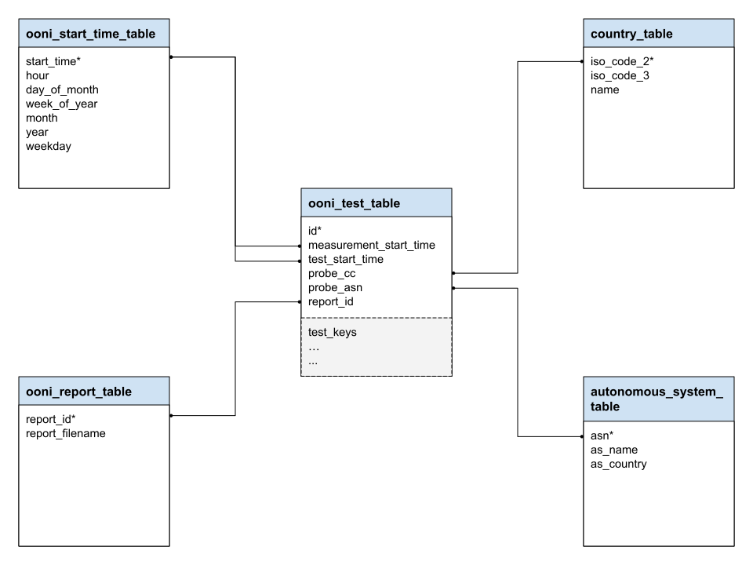

The World Bank Development Indicator data, which is only three fields, is already in a shape that is amenable for running queries against it. 

### Data Sources

There are four sources of data for this project:

1. Open Observatory of Network Interference data (JSONL in `s3://ooni-data/`)
2. World Bank Development Indicator data (API at `https://api.worldbank.org/`)
3. Country Code data (CSV in `s3://udacity-ooni-project/`)
4. Autonomous System data (CSV in `s3://udacity-ooni-project/`)

### Data Destination: Data Lake

The destination for all ETLed data is a data lake. This dat lake is a private S3 bucket created with my Amazon Web Services credentials for this project: `s3://udacity-ooni-project/`.

Once all the data is in the S3 bucket, it will have the following key structure:

```
s3://udacity-ooni-project/
    csv/
        asn.csv
        country_codes.csv
    keys/
        ooni_s3_keys_2013-01.dat
        ooni_s3_keys_2013-05.dat
        ooni_s3_keys_2013-09.dat
        ooni_s3_keys_2013-10.dat
        ...
        ooni_s3_keys_2020-03.dat
        ooni_s3_keys_2020-04.dat
        ooni_s3_keys_2020-05.dat
        ooni_s3_keys_2020-06.dat
    parquet/
        ooni/
            http_requests/
                report_table/
                    2013-01.parquet/
                    ...
                    2020-06.parquet/
                start_time_table/
                    2013-01.parquet/
                    ...
                    2020-06.parquet/
                test_table/
                    2013-01.parquet/
                    ...
                    2020-06.parquet/
            meek_fronted_requests_test/
                report_table/
                    ...
                start_time_table/
                    ...
                test_table/
                    ...
            psiphon/
                report_table/
                    ...
                start_time_table/
                    ...
                test_table/
                    ...
            tor/
                report_table/
                    ...
                start_time_table/
                    ...
                test_table/
                    ...
            vanilla_tor/
                report_table/
                    ...
                start_time_table/
                    ...
                test_table/
                    ...
        worldbank/
            IT.NET.SECR.P6.parquet
            IT.NET.SECR.parquet
            IT.NET.USER.ZS.parquet
            MS.MIL.TOTL.P1.parquet
            MS.MIL.TOTL.TF.ZS.parquet
            MS.MIL.XPND.CN.parquet
            MS.MIL.XPND.GD.ZS.parquet
            MS.MIL.XPND.ZS.parquet
            SP.POP.TOTL.parquet
```


## Step 4: Run ETL to Model the Data

### ETL Apps

There are three apps that perform the work for this data pipeline:

1. [FilterOoniS3Keys](https://github.com/ldnicolasmay/FilterOoniS3Keys), run _**monthly**_, a Scala app that makes use of the [AWS Java SDK v1.x](https://docs.aws.amazon.com/sdk-for-java/v1/developer-guide/welcome.html) to extract all available OONI S3 keys, and filter those keys to include only target OONI tests related to TOR networks (e.g., HTTP requests, Meek fronted requests, Psiphon, Tor, Vanilla Tor), and load the filtered keys into the destination S3 bucket. 

   There are millions of OONI S3 keys to extract and filter. As the log plot demonstrates, there are around 10,000 OONI JSONL records per day since early 2018. Considering only January 2018 through June 2020, we can estimate the number of records that need to be filtered for that time period: 2.5 years &#215; 365 days/year &#215; 10,000 records/day &#8773; 9,000,000 records. (Note that these are samples taken from the 5th, 15th, and 25th day of each month.)
    
    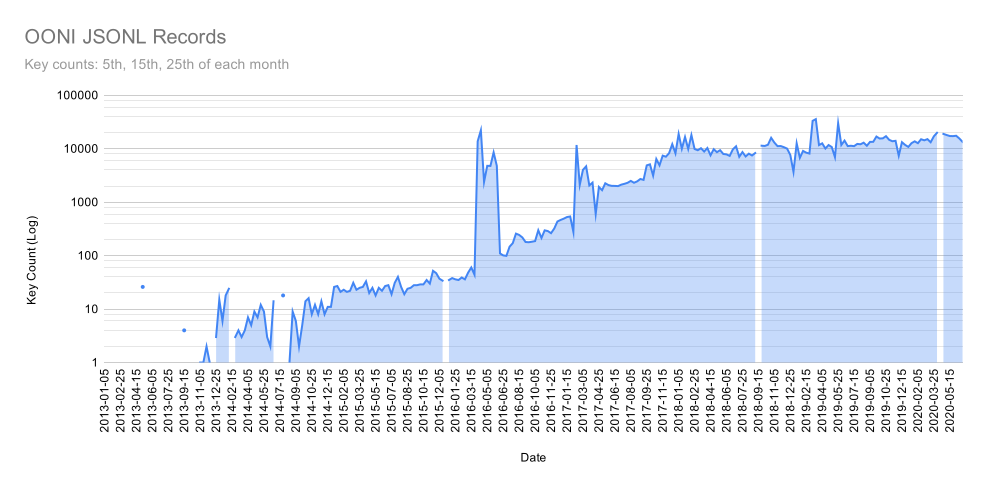
    
2. [EtlOoniTestData](https://github.com/ldnicolasmay/EtlOoniTestData), run _**monthly**_, a Spark app that relies on the S3 keys filtered by the `FilterOooniS3Keys` app to extract only the JSONL data that corresponds to the target OONI tests, transform the data into tables to meet the requirements of a star schema data model, and load the star schema tables into the destination S3 bucket as parquet files.

   There are hundredes of thousands of JSONL S3 keys (one per OONI test report) that contain data for the relevant OONI test type. Here are plots of how many keys exist for each OONI test type.
   
   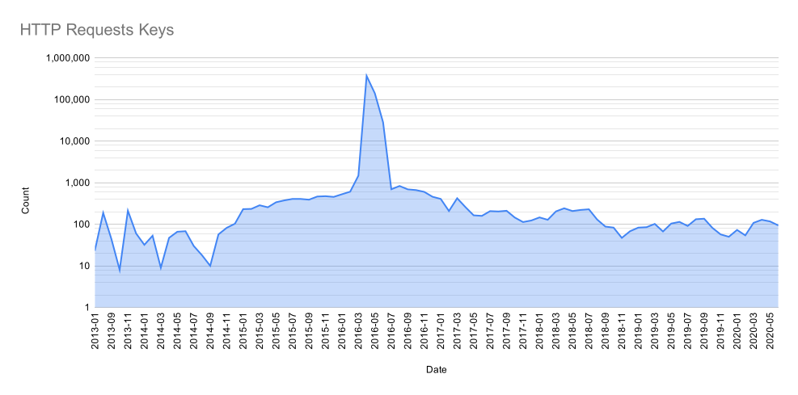
   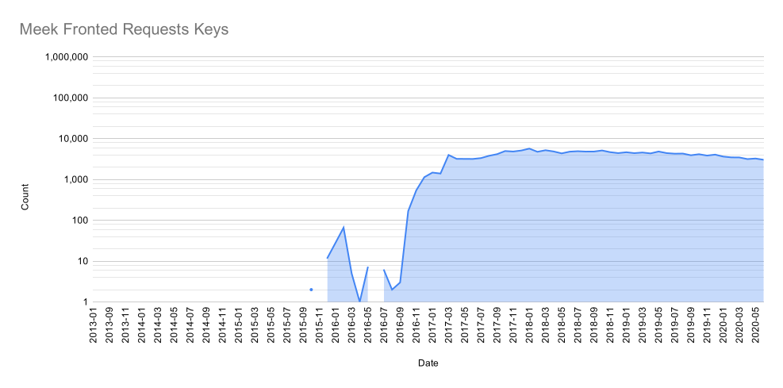
   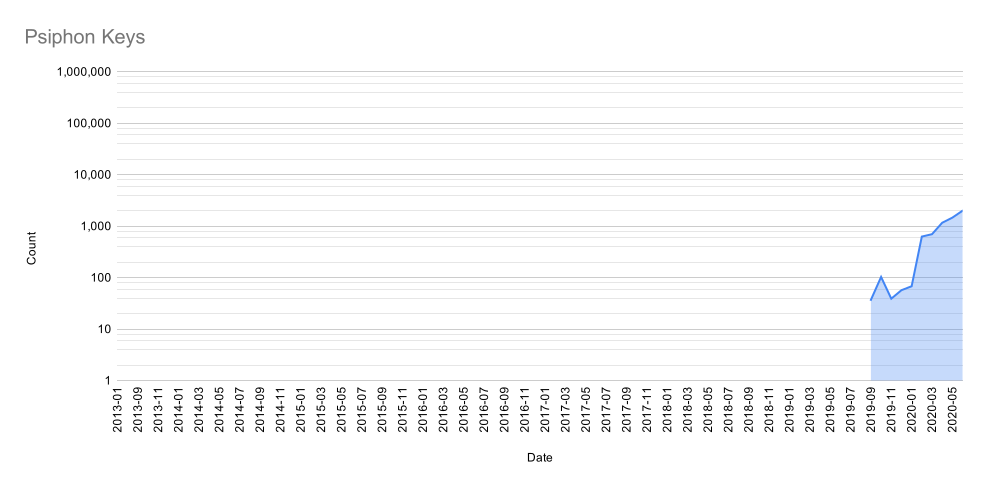
   
   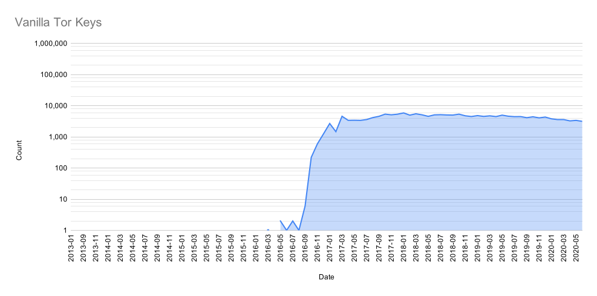
   
   Once the JSONL are load and parsed, the result in millions of test records that are read into Spark Dataset tables. By far most records are of the `http_requests` test type. 
   
   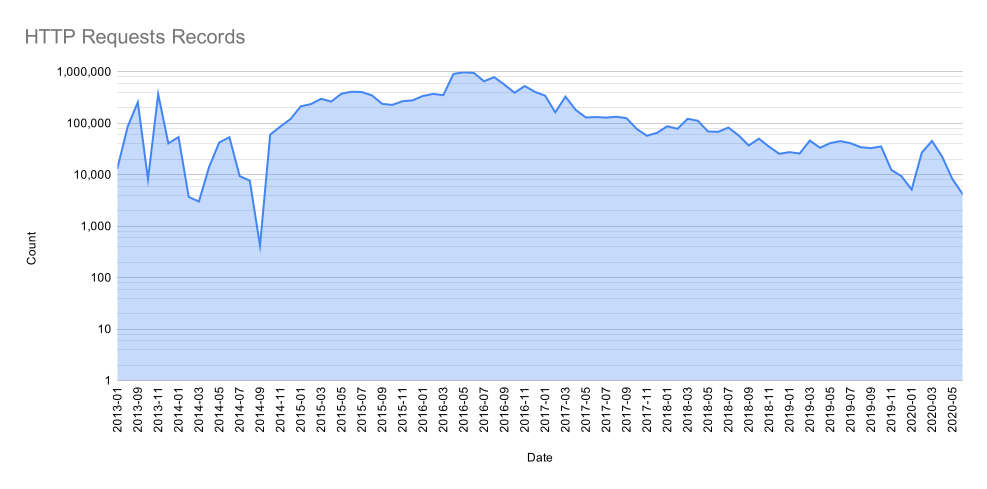
   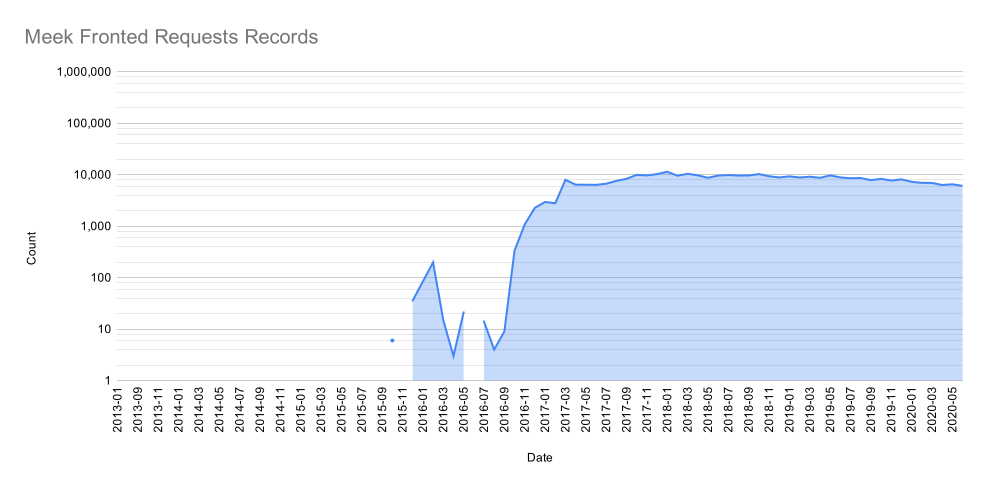
   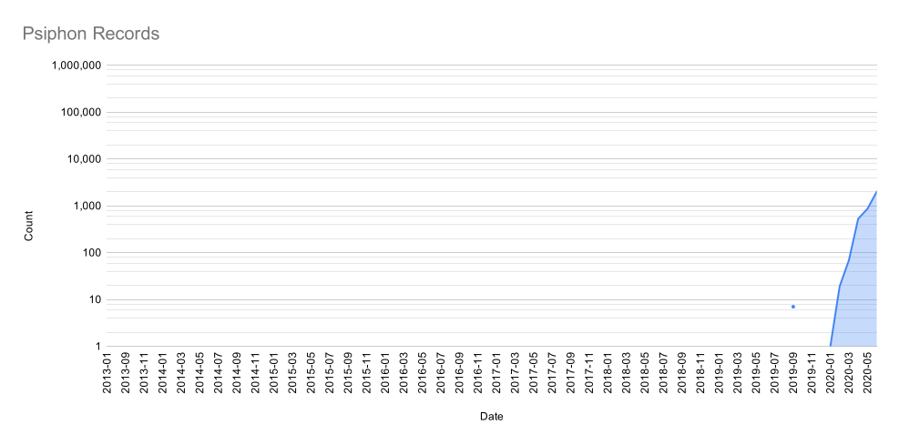
   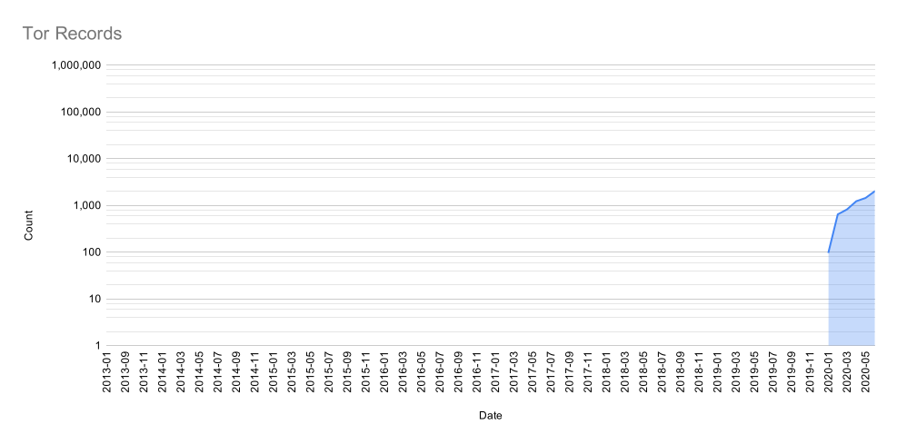
   

3. [EtlWorldBankData](https://github.com/ldnicolasmay/EtlWorldBankData), run _**yearly**_, a Python app that uses the [requests](https://requests.readthedocs.io/en/master/) and [pandas](https://pandas.pydata.org/) modules to extract data from the World Bank's [World Development Indicator](https://data.worldbank.org/indicator) data API, transform the data, then load data into the destination S3 bucket as parquet files.

In the diagram that follows, the `FilterOoniS3Keys` pipeline lies along the top third, the `EtlOoniTestData` pipeline lies in the middle third, and the `EtlWorldBankData` pipeline lies in the bottom third.


### Data Dictionaries

#### OONI Data

For each test type (e.g., `http_requests`, `vanilla_tor`), the data dictionaries for the fact table (`test_table`) is largely the same. For each test type, the dimension tables (`start_time_table`, `report_table`) are the same. 

More details about each field are available on OONI's GitHub page describing the Base Data Format: [https://github.com/ooni/spec/blob/master/data-formats/df-000-base.md](https://github.com/ooni/spec/blob/master/data-formats/df-000-base.md)

1. Test table: `s3://udacity-ooni-project/parquet/ooni/[test_type]/test_table/[YYYY-MO].parquet/`

   | Field Name | Field Description |
   |:-----------|:------------------|
   | `id`                     | ID client-generated UUID4 identifying this test in a report
   | `measurement_start_time` | Time when measurement started
   | `test_start_time`        | Time when a related set of measurements started
   | `probe_cc`               | ISO 3166-1 Alpha-2 country code 
   | `probe_asn`              | Autonomous system network number of OONI probe
   | `report_id`              | ID of a set of related measurements generated by OONI backends 
   
2. Start time table: `s3://udacity-ooni-project/parquet/ooni/[test_type]/start_time_table/[YYYY-MO].parquet/`

   | Field Name | Field Description |
   |:-----------|:------------------|
   | `start_time` | Measurement or test start datetime
   | `hour`       | Hour derived from `start_time`
   | `day`        | Day of month derived from `start_time`
   | `weekday`    | Day of week derived from `start_time` (1 = Sunday, 7 = Saturday)
   | `week`       | Week of year derived from `start_time`
   | `month`      | Month derived from `start_time`
   | `year`       | Year derived from `start_time`

3. Report table: `s3://udacity-ooni-project/parquet/ooni/[test_type]/report_table/[YYYY-MO].parquet/`

   | Field Name | Field Description |
   |:-----------|:------------------|
   | `report_id`       | ID of a set of related measurements generated by OONI backends
   | `report_filename` | Name of file containing report

#### World Bank Development Indicator Data

All tables of World Bank data have the same data dictionary.

1. Secure internet servers (per million people): `s3://udacity-ooni-project/parquet/worldbank/IT.NET.SECR.P6.parquet`
2. Secure internet servers: `s3://udacity-ooni-project/parquet/worldbank/IT.NET.SECR.parquet`
3. Individuals using the internet (% of population): `s3://udacity-ooni-project/parquet/worldbank/IT.NET.USER.ZS.parquet`
4. Armed forces personnel, total: `s3://udacity-ooni-project/parquet/worldbank/MS.MIL.TOTL.P1.parquet`
5. Armed forces personnel (% of total labor force): `s3://udacity-ooni-project/parquet/worldbank/MS.MIL.TOTL.TF.ZS.parquet`
6. Military expenditure (current local currency): `s3://udacity-ooni-project/parquet/worldbank/MS.MIL.XPND.CN.parquet`
7. Military expenditure (% of gross domestic product): `s3://udacity-ooni-project/parquet/worldbank/MS.MIL.XPND.GD.ZS.parquet`
8. Military expenditure (% of general government expenditure): `s3://udacity-ooni-project/parquet/worldbank/MS.MIL.XPND.ZS.parquet`
9. Population (total): `s3://udacity-ooni-project/parquet/worldbank/SP.POP.TOTL.parquet`

   | Field Name    | Field Description |
   |:--------------|:------------------|
   | `iso_code_3`  | ISO 3166-1 Alpha-3 country code 
   | `year`        | Year
   | `value`       | Value for given country and year

#### Country Data

1. Country data: `s3://udacity-ooni-project/csv/country_codes.csv`

   | Field Name     | Field Description | 
   |:---------------|:------------------|
   | `name`         | Country name
   | `alpha-2`      | ISO 3166-1 Alpha-2 country code
   | `alpha-3`      | ISO 3166-1 Alpha-3 country code
   | `country-code` | ISO 3166-1 Numeric country code
   | `iso_3166-2`   | ISO 3166-2 Subdivision code link
   | `region`                   | Region
   | `sub-region`               | Sub-region
   | `intermediate-region`      | Intermediate region
   | `region-code`              | Region code
   | `sub-region-code`          | Sub-region code
   | `intermediate-region-code` | Intermediate sub-region code

#### Autonomous System Data

1. Autonomous system data: `s3://udacity-ooni-project/csv/asn.csv`

   | Field Name | Field Description |
   |:-----------|:------------------|
   | `ASN`      | Autonomous system network number
   | `Name`     | Autonomous system network name
   | `Country`  | ISO 3166-1 Alpha-2 country code where autonomous system network is registered

### Data Quality Checks

Many data quality checks for the extracted OONI data are made possible by the types defined in the Spark Dataset schema defined in the OONI ETL Spark app's `package.scala` file, available here: [https://github.com/ldnicolasmay/EtlOoniTestData/blob/master/src/main/scala/EtlOoniTestData/package.scala](https://github.com/ldnicolasmay/EtlOoniTestData/blob/master/src/main/scala/EtlOoniTestData/package.scala). For a project of this scope, many other data quality checks could be built.


## Step 5: Complete Project 

### Querying the Data

With all the data stored in an S3 data lake, we can run some queries to see if there are interesting findings by country and/or year.

For example, if we're interested in seeing if a country's population is a good predictor of how many HTTP Request OONI tests will be run, we can look at some countries' population from 2014 (earliest year with steady OONI data) to 2019 (most recent World Bank population data) and compare by-country and by-year population to by-county and by-year HTTP Request counts. We will limit our query to the 10 most populous countries in 2019, which are, in descending order: China, India, United States, Indonesia, Pakistan, Brazil, Nigeria, Bangladesh, Russia, Mexico.

The Spark code that builds this query is available here: [https://github.com/ldnicolasmay/EtlOoniTestData/blob/master/src/main/scala/EtlOoniTestData/Query.scala](https://github.com/ldnicolasmay/EtlOoniTestData/blob/master/src/main/scala/EtlOoniTestData/Query.scala)

The resulting query table is written to the S3 bucket at `s3://udacity-ooni-project/csv/query/population_http_requests.csv/part-00000-f1319ca5-ccc4-4a50-910a-6b12da380d37-c000.csv`.

Here's each country's population between 2014 and 2019 (inclusive):

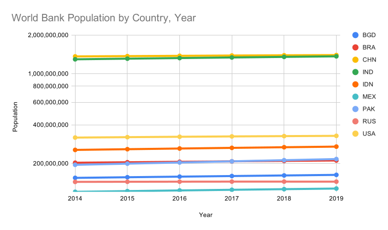

Here's each country's OONI HTTP Request tests between 2013 and 2019 (inclusive):

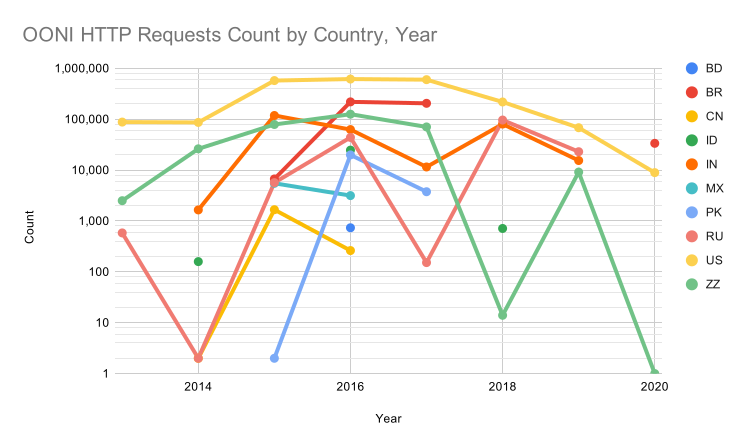

Just looking at the three most populous countries (China, India, United States), we see that their OONI HTTP Requests do _**not**_ correlate. So, country population doesn't seem to have a relationship with the number of OONI HTTP Requests originating from a particular country. There must be other factors at work.