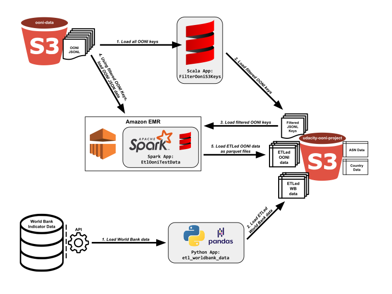

# Open Observatory of Network Interference (OONI) Data ETL

## Overview

Since 2012, the [Open Observatory of Network Interference](https://ooni.org) (OONI) project helps the global community measure internet censorship. OONI makes apps that help internet users test networks that may be targeted by their countries governments.  When combined with other world development indicator statistics availabe from the World Bank, we may be able to illuminate trends in use by internet users concerned about their governments' restriction of internet traffic. Of interest for this project are OONI tests that probe networks related to [Tor](https://www.torproject.org/) internet traffic.

Some of use of OONI tests performed by citizens in particular countries may be illuminated by those countries' Development Indicator data, provided by the [World Bank](https://www.worldbank.org/). Of interest for this project are development indicator data related to this projects are internet usage statistics, secure internet server statistics, military personnel and expenditure statistics, and total population statistics.

Where possible, OONI test data includes the country and the autonomous system that a user initiated a test from within.

## Raw Data

#### OONI Data
 
Most of the data that needs to read and transformed exists as JSONL records in an S3 bucket (`s3://ooni-data/`) that Amazon Web Services hosts free of charge as a public service in its Registry of Open Data: [AWS Registry of Open Data OONI page](https://registry.opendata.aws/ooni/). 

The tests of interest for this project are those that probe TOR networks:

1. [HTTP Requests](https://ooni.org/nettest/http-requests/)
1. [Meek fronted requests](https://ooni.org/nettest/meek-fronted-requests/)
1. [Psiphon](https://ooni.org/nettest/psiphon/)
1. [Tor](https://ooni.org/nettest/tor/)
1. [Vanilla Tor](https://ooni.org/nettest/vanilla-tor/)

#### World Bank Indicator Data

The World Bank's World Development Indicator data includes statistics by country and year that facilitates fair comparison between countries on important development indicators. More information on World Development Indicator data can be at [http://datatopics.worldbank.org/world-development-indicators](http://datatopics.worldbank.org/world-development-indicators). 

World Development Indicator data can be access via an API, which is thoroughly documented at [https://datahelpdesk.worldbank.org/knowledgebase/articles/889386-developer-information-overview](https://datahelpdesk.worldbank.org/knowledgebase/articles/889386-developer-information-overview). 

#### Country Code Data

Country name, ISO-2 code, and ISO-3 code data is stored as a CSV in the `s3://udacity-ooni-project/` S3 bucket.

#### Autonomous System Data

Autonomous System data (more info on AS at [https://en.wikipedia.org/wiki/Autonomous_system_%28Intenet%29](https://en.wikipedia.org/wiki/Autonomous_system_%28Internet%29)) is also stored as a CSV in the `s3://udacity-ooni-project/` bucket.
 

## Data Pipeline

### Data Sources

There are four sources of data for this project:

1. Open Observatory of Network Interference data (JSONL in `s3://ooni-data/`)
2. World Bank Development Indicator data (API at `https://api.worldbank.org/`)
3. Country Code data (CSV in `s3://udacity-ooni-project/`)
4. Autonomous System data (CSV in `s3://udacity-ooni-project/`)

### Data Destination

The destination for all ETLed data is a private S3 bucket created with my Amazon Web Services credentials for this project: `s3://udacity-ooni-project/`.

### ETL Apps

There are three apps that perform the work for this data pipeline:

1. `FilterOoniS3Keys`, a Scala app that makes use of the [AWS Java SDK v1.x](https://docs.aws.amazon.com/sdk-for-java/v1/developer-guide/welcome.html) to extract all available OONI S3 keys, and filter those keys to include only target OONI tests related to TOR networks (e.g., HTTP requests, Meek fronted requests, Psiphon, Tor, Vanilla Tor), and load the filtered keys into the destination S3 bucket.

    There are millions of OONI S3 keys to extract and filter. As the log plot demonstrates, there are around 10,000 OONI JSONL records per day since early 2018. Considering only January 2018 through June 2020, we can estimate the number of records that need to be filtered for that time period: 2.5 years &#215; 365 days/year &#215; 10,000 records/day &#8773; 9,000,000 records.
    
    
    
2. `EtlOoniTestData`, a Spark app that relies on the S3 keys filtered by the `FilterOooniS3Keys` app to extract only the JSONL data that corresponds to the target OONI tests, transform the data into tables to meet the requirements of a star schema data model, and load the star schema tables into the destination S3 bucket as parquet files.

3. Baz qux

